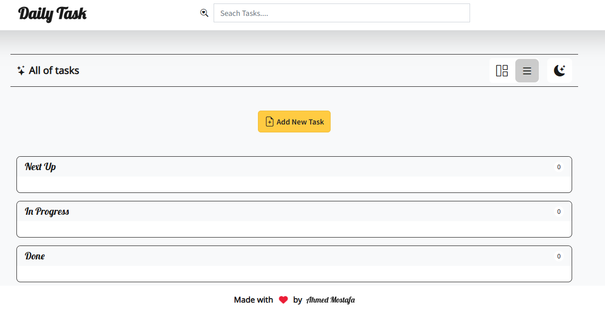
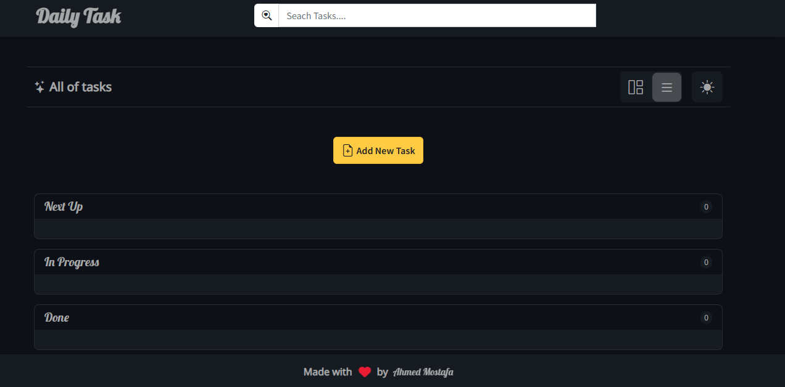
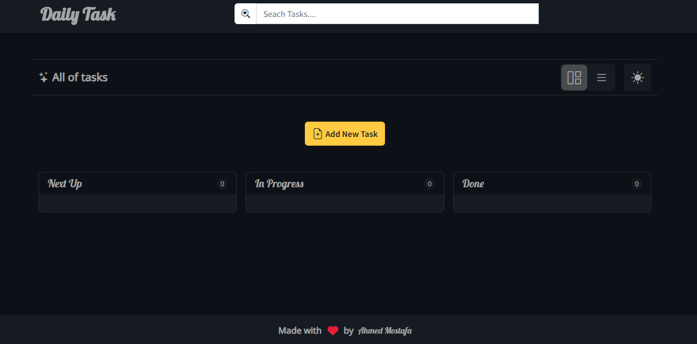

# Daily Task - ToDo List Web App

A stylish and functional ToDo list web application to help you stay productive and organized. Built with simplicity and elegance, the app supports task categorization, status tracking, and a responsive dark/light theme toggle.

## 📸 Screenshot





## 🚀 Live Demo

[Todo-App](https://ahmedmostafa-io.github.io/Todo-App/)

## 🚀 Features

- _Add/Edit/Delete Tasks_  
  Easily create, update, or remove your daily tasks.

- _Drag & Drop Task Management_  
  Organize your tasks into three categories:

  - _Next Up_
  - _In Progress_
  - _Done_

- _Category Labels_  
  Add contextual tags to your tasks (e.g., Education, Work, Personal).

- _Dark/Light Mode Toggle_  
  Switch between themes for a personalized experience.

- _Clean & Intuitive UI_  
  Smooth UX with responsive design for all devices.

## 🛠 Tech Stack

- _Frontend_: HTML, CSS, JavaScript
- _UI Libraries_: ( Bootstrap)
- _Icons_: (FontAwesome)

## Getting Started

### Prerequisites

- Node.js and npm installed on your machine.

### Installation

````bash
git clone https://github.com/ahmedmostafa-io/Todo-App
cd daily-task-todo
npm install
npm start

````
### Folder Structure

```plaintext
project-root/
├── css/
│   ├── style.css
│   ├── bootstrap.min.css
│   ├── bootstrap-icons.css
│   └── all.min.css            # Font Awesome styles
├── js/
│   └── script.js
├── fonts/
│   ├── fontawesome/           # Font Awesome assets
│   └── bootstrap-icons/       # Bootstrap Icons assets
├── index.html
└── README.md
````

## 📄 License

this project based on project at route academy.
I customized it by adding a dynamic background animation and LocalStorage.

---

📬 Feedback

Feel free to fork the project, suggest improvements, or report bugs!

---

> ✨ Made with love by Ahmed Mostafa

```

```
